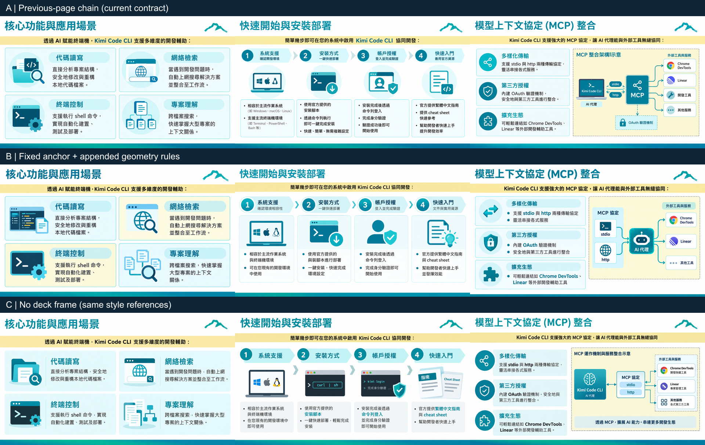

# 簡報跨頁一致性調查

2026-09-20；程式基線 `7f9a176`。本次只有調查與實驗，沒有修改生成流程、模型庫或既有專案。

大方向的風格傳遞已經有效，但固定元件仍由模型逐頁重畫。問題包含：缺少整份簡報共同規格、批次起跑時沒有前頁可參考、參考頁隨完成順序變化，以及文字規格與實際參考圖不一致。直接追加更精準的文字規則，本次反而使底條厚度與圖標有無更不穩定，不能直接採用為修正。

## 看對照



- A：現行完整合約，依序參考上一張生成的內頁。
- B：固定參考同一張內頁，並在原 designSystem 後追加明確座標、尺寸、純色底條及不畫右上圖標的要求。
- C：保留原風格規格與三張風格參考圖，但不附 deck-frame，模擬沒有可用前頁時的輸入條件。

每組為相同三頁內容：功能四宮格、安裝流程、MCP 架構。另生成一張內頁作共同起點，共 10 次真實 GPT 生圖。

## 實測結果

使用使用者既有 CLI2Proxy 連線的 `gpt-image-2.5-sunburst`、`images` 通道，直接呼叫目前的 `OpenAiCompatibleImageProvider.generate()`，沿用完整共用影像合約、原圖附件順序及產品正規化流程。沒有改 transport 或使用簡化 prompt。

素材為既有 Kimi CLI 專案的「玉山ithome」風格（1,604 字 designSystem、三張風格圖）與第 2–5 頁；原專案只讀。其既有單頁 imagePrompt 也原樣保留，因此這是現實輸入的診斷，不是無衝突的理想化模型基準。

| 量測               | A：前頁鏈             | B：固定圖＋追加規格   | C：無前頁             |
| ------------------ | --------------------- | --------------------- | --------------------- |
| 三頁底部色帶厚度   | 40 / 39 / 39 px       | 40 / 32 / 20 px       | 43 / 41 / 41 px       |
| 標題可見色字頂端 y | 37 / 37 / 38 px       | 38 / 38 / 37 px       | 50 / 42 / 41 px       |
| 標題可見色字左端 x | 39 / 39 / 42 px       | 48 / 38 / 41 px       | 40 / 44 / 44 px       |
| 右上山形圖標       | 有 / 有 / 有          | 有 / 無 / 有          | 有 / 有 / 有          |
| 單張耗時           | 42.6 / 29.8 / 34.9 秒 | 43.8 / 31.1 / 43.4 秒 | 39.2 / 40.4 / 28.6 秒 |

原始規格已要求全寬 6px 底條，但起點圖就畫成 40px 漸層。A 成功沿用這個實際外觀；它是「視覺較一致、但不忠於文字規格」。B 再次明訂 y=1074..1079、6px、#008B9B 實心、無漸層，結果仍沒有一張達標；同一條「不畫右上圖標」也只有中間一頁採納。C 的標題高度位置與元件處理變化比較明顯，尤其流程頁的圖示從統一藍綠插畫變成彩色作業系統圖標與擬真終端機。

這支持「前頁參考有用」和「追加規則不足以鎖住固定元件」。**不能從 B 推論固定範本本身沒用**：B 同時改了參考頁選擇與文字規格，且追加規格與舊規格的邊距／圖標存在衝突。這組刻意檢驗低成本的追加做法，不是乾淨結構化規格的效果測試。

所有 10 張原始輸出都是 1672×941，再由產品正規化至 1920×1080。這次沒有輸出比例跳動的證據，故不把 header／底條變化歸因於某次尺寸裁切。解析度仍需放大，會影響細線銳利度，但與跨頁幾何一致性是兩個問題。

用量：input 74,211 tokens、output 8,366 tokens，合計 82,577 tokens。各請求耗時加總 374.0 秒（兩條實驗鏈部分重疊，不等於實際牆鐘時間）。費用未由端點回報，沒有估算金額。輸出 tokens 為 301、515 或 1,158，不能套用歷史「每張固定 1,158」的假設。

逐張用量、尺寸、像素量測、Laplacian 與頻域結果見 [measurements.json](measurements.json)。銳利度數值受內容結構影響，沒有拿它作一致性排名。

## 證據 → 問題 → 改善路徑

| 證據                                                                                                                                                       | 問題                                                                   | 改善路徑                                                                                           |
| ---------------------------------------------------------------------------------------------------------------------------------------------------------- | ---------------------------------------------------------------------- | -------------------------------------------------------------------------------------------------- |
| [createDefaultStyle](../../../packages/core/src/project.ts) 只給自由設計描述、沒有共同設計規格或參考圖；本機 31 份專案中 27 份 designSystem 空白           | 每頁仍可能自行決定視覺語言；27/31 是設定盤點，並非失敗率               | 自由設計在整份生成前建立一次共同規格，保存於專案，後續重生沿用                                     |
| [jobs.ts](../../../apps/server/src/jobs.ts) `schedule()` 按 provider slot 排程；預設並行 2；`chooseDeckFrame()` 只查已完成前頁                             | 全新 deck 前兩頁可同時沒有 frame；實際參考頁受完成時間影響             | 先產出合格內頁範本，再開放其餘頁並行；不是把整批改成單線串行                                       |
| `chooseDeckFrame()` 依 order 往前找，沒有頁型分類，也沒有視覺品質評分                                                                                      | 封面／段落頁可能成為下一個普通內頁的範本；較新的頁不等於較好的共同範本 | 明確區分封面、段落與內容頁，為內容頁保存固定 anchor；選圖策略須獨立 A/B 驗證                       |
| [deckFrameRule](../../../packages/core/src/image-contract.ts) 在 designSystem 空白時仍說 STYLE references 是權威，frame「never becomes a master template」 | 當 STYLE references 也空白，合約指向不存在的風格權威                   | 對「無 designSystem 且無 STYLE 圖」給出明確分支，先建立共同風格或明確授權選定 anchor               |
| 既有風格寫 6px 飾條，但生成起點為 40px 漸層；B 指令採納不一致                                                                                              | 文字規格與圖像範本各自成為不同的設計依據                               | 先消解規格衝突，再產出與該規格相容的 anchor；不要一邊維持舊圖、一邊用追加句推翻它                  |
| 既有 style 記載右上品牌 Icon、頁尾頁碼；合約禁止移植 logo／頁碼，frame 又籠統說忽略 footer                                                                 | 裝飾線、品牌圖標與文字頁尾的責任邊界不夠清楚                           | 明確區分非文字框架、授權品牌素材、系統頁碼、禁止複製的來源文字                                     |
| fixture 的 imagePrompt 分別含 micro-illustration、minimalist outline、neon cyber，起點還含紫色；全局風格卻禁止紫色                                         | 舊的單頁視覺指令與共同風格相互干擾；合約有優先序，但仍增加模型解讀負擔 | 保留單頁內容與構圖意圖，把共同材質、色票、線條風格集中到同一規格；不可偷偷覆寫使用者明示的單頁例外 |
| `limitReferences()` 超額先保 style／content，deck-frame 最後                                                                                               | 素材較多的頁面可能沒有 frame                                           | 記錄缺失原因並讓診斷可見；不能為了外框一致而靜默丟掉使用者選的內容圖                               |
| `validatedOutput()` 及落地流程檢查檔案格式／大小，沒有跨頁框架比對                                                                                         | 漂移的圖片仍正常顯示成功，也可能再成為後頁範本                         | 增加幾何與視覺一致性檢查，記錄 anchor id、版本及偏差數值，不記正文                                 |

排程、選圖及優先序是程式碼直接確認；其對長 deck 的累積影響是風險推論，本次沒有跑 20 頁長鏈或並行排程的 live 重現。

## 建議實作順序

1. **先固定整份簡報的設計決策。** 自由設計只做一次全局規格；既有風格把共同框架與頁型例外整理清楚。應包含標題區、內容安全區、背景、字階、線條、圓角、底部裝飾，座標使用明確畫布或正規化單位。不要默默變更既有 style 的使用者設定。
2. **讓後續頁穩定拿到合適的內頁範本。** 不直接把第一頁封面當萬用模板；先產出／挑選內容頁 anchor，檢查合格後才並行生成其餘頁，重生時沿用固定版本。快取要與 style revision、模型、canvas、anchor version 綁定；anchor 失敗／被取消時不得死等或偷偷採用壞圖。
3. **對必須精準的外框，採確定性合成。** 例如底部飾條、分隔線、固定品牌標記，與現有頁碼一樣由程式渲染；模型主要負責內容區。須先定義並驗證保留區，不能事後用白色遮條硬蓋既有內容。標題文字若也需要像素級一致，需獨立文字層與明確 title 欄位，是更大範圍的設計，不應混進小修。這一方案尚未實作／實測。
4. **加入一致性驗收，再決定是否需要有限重試。** 非文字框架可用像素／色帶檢查；字階與圖示語言可用 OCR／視覺模型作輔助。先以告警呈現，避免誤判直接燒配額。若重試，必須附上失敗成品、對照 anchor 和逐項偏差，不能只說「與上一頁保持一致」。

第一階段的驗證應拆開三個因素：只固定 anchor、只整理無衝突規格、兩者結合。至少跨三種風格，包含封面→內頁、長標題、圖表頁、密集內容及單頁重生；每個固定輸入重複三次，另測亂序完成與取消。衡量框架偏差、內容遺漏、錯誤繼承、耗時和 token，不能只看縮圖好不好看。

目前不建議把 B 的追加 prompt 上線，也不建議先換更大文字模型、固定 seed 或全面串行。這些都沒有本次實測證據支持；當前回傳尺寸相同，也不應先從 size／quality 參數解這個問題。

## 量測與重現

完整 PNG、每次 prompt、每次用量與腳本保留在 `/private/tmp/slide-consistency-20260920/`；該目錄是暫存證據，可能被系統清理。本報告、對照 JPG 與所有數字則持久保存在本目錄。JPG 只供查看，所有像素量測使用原始正規化 PNG。

原腳本位置：`/private/tmp/slide-consistency-probe.mts`、`/private/tmp/slide-consistency-measure.mjs`、`/private/tmp/slide-consistency-frequency.py`。生圖腳本讀取本機模型庫憑證於記憶體，沒有把 key 寫進 prompt、報告或輸出 log。它會跳過既有輸出；重新取樣需將腳本的 `out` 改為新的測試目錄。

在專案根目錄執行下列命令可重現原呼叫流程；生圖會消耗配額，兩條生圖指令總共 10 張：

```sh
NODE_OPTIONS=--conditions=development node --import tsx /private/tmp/slide-consistency-probe.mts
NODE_OPTIONS=--conditions=development node --import tsx /private/tmp/slide-consistency-probe.mts --no-frame
node /private/tmp/slide-consistency-measure.mjs
.venv-ocr/bin/python /private/tmp/slide-consistency-frequency.py
```

色帶量測：底部 20% 範圍內，符合 R<100、G>80、B>65、G>R+40、B>R+30 的像素超過該列 95%，累計列數。這是本 fixture 藍綠底條的啟發式，不是泛用的線寬偵測。標題座標也是以相同色域搜尋 x<1550、y<160 的可見色字邊界，不是 OCR 字框或字型大小，不能拿來比較不同顏色的風格。

Laplacian 為 RGB 灰階加權後四鄰域算子變異數。高頻能量使用去均值＋Hann window 的 2D FFT，半徑以頻域角落為 1，取 0.87–1.0 的能量比例；口徑可能與舊實驗不同，不作跨實驗比較。

限制：每組三張為三種不同內容，每個內容只取樣一次；足以展示失敗形狀，不能估算穩定失敗率。本次只有一個 GPT 影像型號、一種既有風格；沒有推廣成所有模型／所有簡報都會如此。自由設計另外檢視了既有 GPT 四頁成品，但沒有再做該風格的 live 對照。

既有合約回歸測試：`deck-frame-reference.test.ts` 11 項、`deck-chrome-contract.test.ts` 6 項，合計 17 項通過。它們驗證文字與角色規則，不保證模型視覺遵循。未修改產品程式碼，因此沒有執行完整 `pnpm check`。
